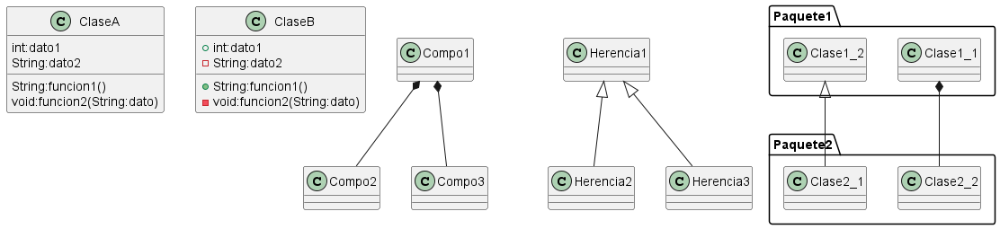
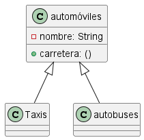
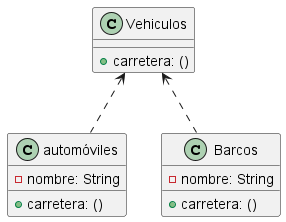
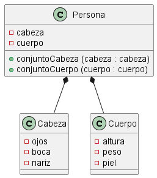
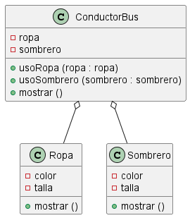
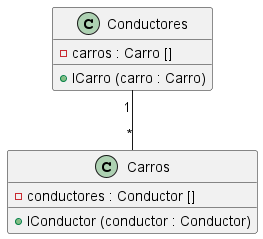
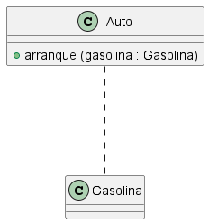

# Diagrama de Clases



Explicación de relación entre diagrama de clases...

## Relación Herencia

La herencia es una relación entre dos clases donde una clase hereda los atributos y métodos de otra clase. En el diagrama de clases, se representa mediante una línea sólida con una flecha apuntando hacia la clase base.
>Por ejemplo: autobuses, taxis y automóviles son automóviles, todos tienen nombres y todos pueden estar en la carretera



## Relación Implementación

La implementación es una relación entre una clase y una interfaz donde la clase implementa los métodos definidos en la interfaz. En el diagrama de clases, se representa mediante una línea punteada con una flecha apuntando hacia la interfaz.

>Por ejemplo: los automóviles y los barcos son vehículos, y el vehículo es solo un concepto abstracto de una herramienta móvil, y el barco y el vehículo realizan las funciones móviles específicas.



## Relacion Composición

La composición es una relación entre dos clases donde una clase contiene a la otra como parte de su estructura. En el diagrama de clases, se representa mediante una línea sólida con un rombo lleno en el extremo de la clase que contiene a la otra.

>Por ejemplo: una persona está compuesta por una cabeza y un cuerpo. Los dos son inseparables y coexisten.



## Relación Agregación

La agregación es una relación entre dos clases donde una clase contiene a la otra como parte de su estructura, pero la clase contenida puede existir independientemente de la clase contenedora. En el diagrama de clases, se representa mediante una línea sólida con un rombo vacío en el extremo de la clase que contiene a la otra.

> Por ejemplo: los conductores de autobús y la ropa y los sombreros de trabajo son parte de la relación general, pero se pueden separar. La ropa de trabajo y los sombreros se pueden usar en otros conductores. Los conductores de autobuses también pueden usar otra ropa de trabajo y sombreros.



## Relación Asociación

La asociación es una relación entre dos clases donde una clase utiliza a la otra de alguna manera, pero no está directamente contenida en ella ni hereda de ella. En el diagrama de clases, se representa mediante una línea sólida sin ningún símbolo especial.

>Por ejemplo: coches y conductores, un coche corresponde a un conductor en particular y un conductor puede conducir varios coches.



### Relación  Dependencia

La dependencia es una relación entre dos clases donde una clase utiliza a la otra en algún punto, pero no está directamente relacionada con ella. En el diagrama de clases, se representa mediante una línea punteada sin ningún símbolo especial.

>Por ejemplo: El auto depende de la gasolina. Si no hay gasolina, el automóvil no podrá conducir.



# EJEMPLO

Se necesita un sistema en el cual se pueda recaudar la información sobre la compra de un producto en una página web, para ello tener en cuenta lo siguiente:

En la clase de  `Pedidos` en la cual se puedan agregar los siguientes atributos:

```
+ Id
+ Fecha de pedido
+ Estado 
de Pedido
    + Pendiente
    + En curso
    + Completado
+ Cliente (Contenga class Cliente)
+ Productos (Contenga class Productos)

* Agregar Productos
* Calcular el Total
```

También se necesita la siguiente información de los `Cliente`:

```
+ Id
+ Nombre
+ Direccion
+ Telefono
+ Correo Electronico
```

También se necesita información sobre los `Productos` en los cuales el cliente está interesado en comprar:

```
+ Id
+ Nombre
+ Descripsión
+ Precio
+ Categoria
+ Stock
```

> Diagrama de Clases


> ASOCIACIÓN

Cliente "1"---"*" Pedido
+ La clase Cliente se relaciona con la clase Pedido mediante una asociación.
Esto significa que un cliente puede realizar varios pedidos.

> COMPOSICIÓN

Pedido *-- Producto
+ La clase Pedido se relaciona con la clase Producto mediante una composición.
Esto significa que un pedido puede contener varios productos.
Pero un pedido no puede existir sin productos.

`@Nicolas Tello`
